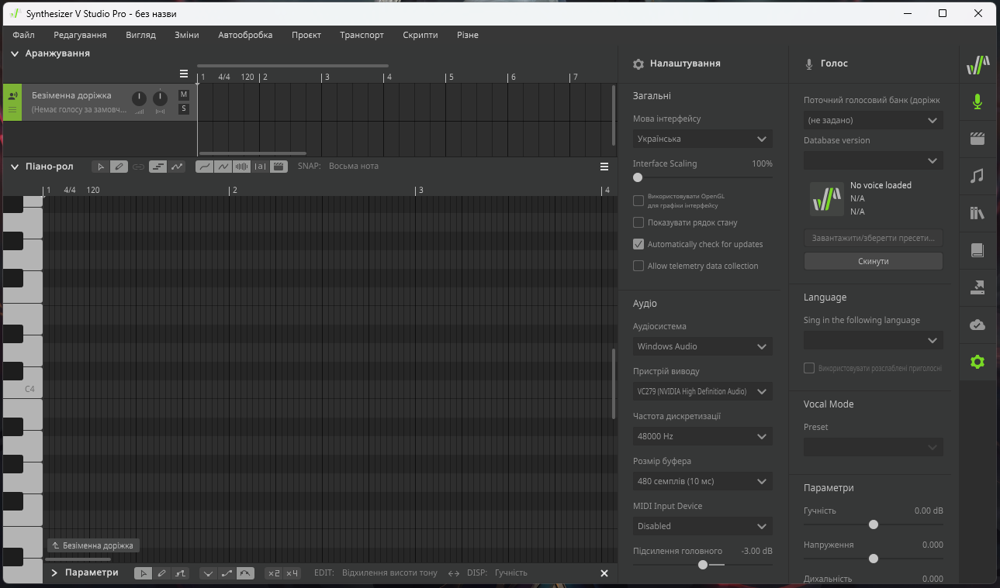

# Synthesizer-V-Studio-Ukrainian-Translation
Українська для Synthesizer V Studio. Перекладено більшість вмісту. Проблема є в тому, що у програми немає нормального зразка, на основі якого можна зробити переклад, а усі інші локалізації по-різному застарілі.

## Встановлення:
* Перемістити файл **uk-ua.txt** до теки `Документи/Dreamtonics/Synthesizer V Studio/translations`
* Перемістити файл **NotoSansCJKjp-Regular.otf** до теки `fonts` кореневої директорії програми
* Запустити програму, відкрити налаштування і обрати мову інтерфейсу "Українська".

## Примітки:
Довелося використовувати стандартний Noto Sans шрифт замість CJK версії, оскільки в ньому немає українських літер, а редактор шрифтів відмовляється експортувати шрифт зі змінами.

